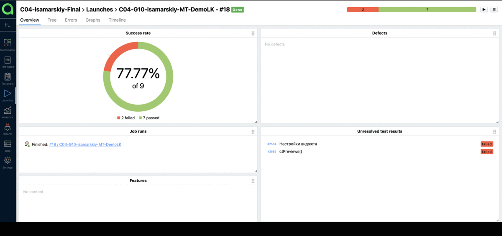
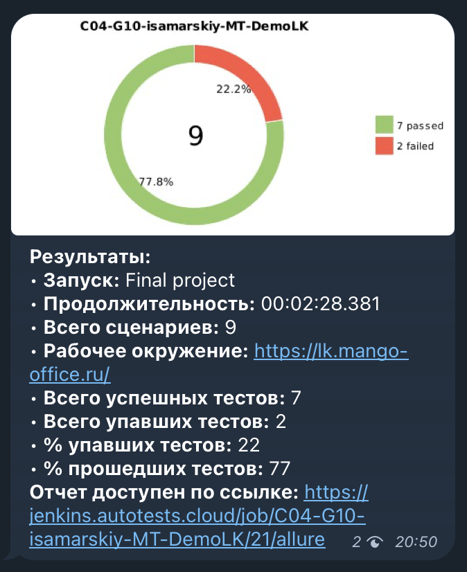
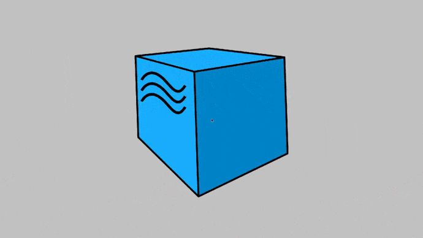

# UI autotests for demo page lk.mango-office.ru

## Technology stack

| Java | Junit5 | RestAssured | Gradle | Selenide | Selenoid | Allure Report |   
| :---------: | :---------: | :---------: | :---------: | :---------: | :---------: | :---------: |
|</a> |</a> | </a> | </a> |</a> | </a> | </a> 

| Allure TestOps  | Jenkins | GitHub | Telegram |
| :---------: | :---------: | :---------: | :---------: | 
| </a>|</a> | </a> | </a> 

### For run tests

* remote.driver (url address for selenoid)
* browser (chrome, firefox)
* video.storage 

#### Allure TestOps

#### Telegram notification

#### Selenoid video

