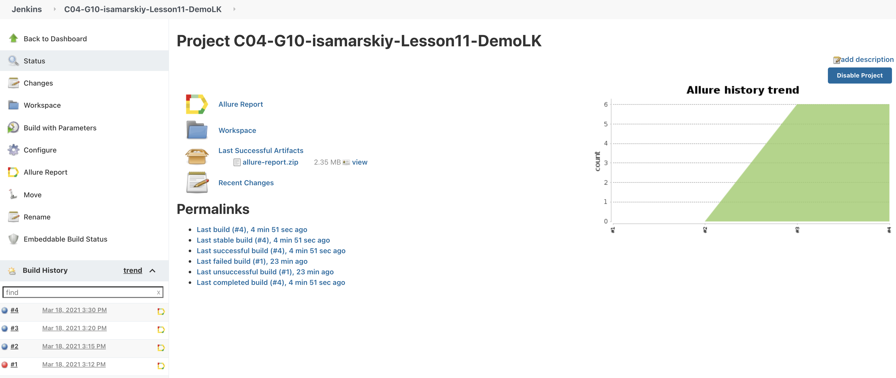
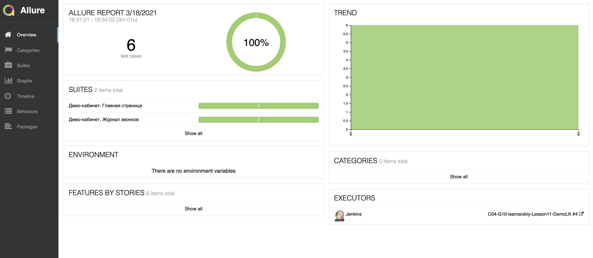
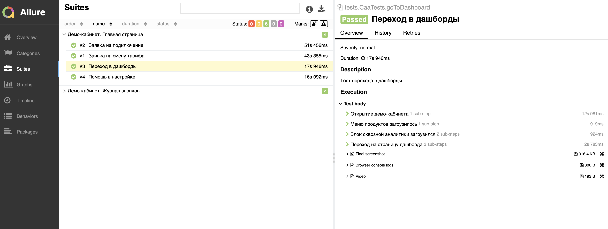
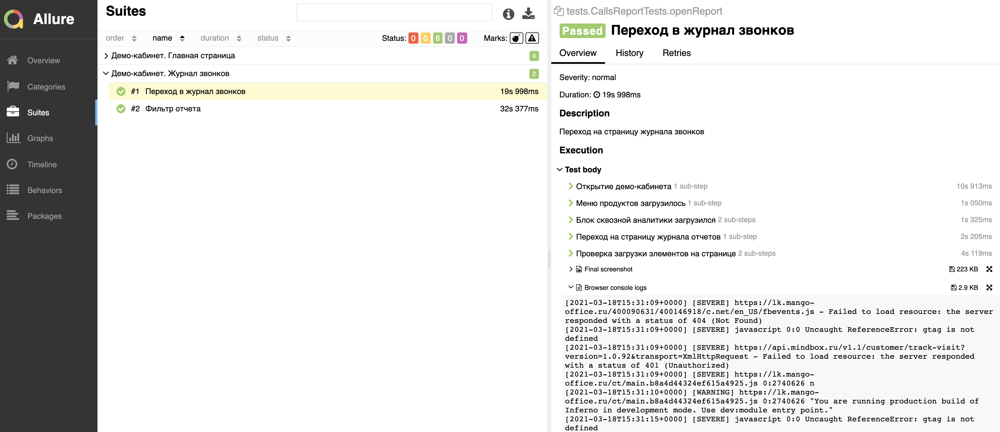
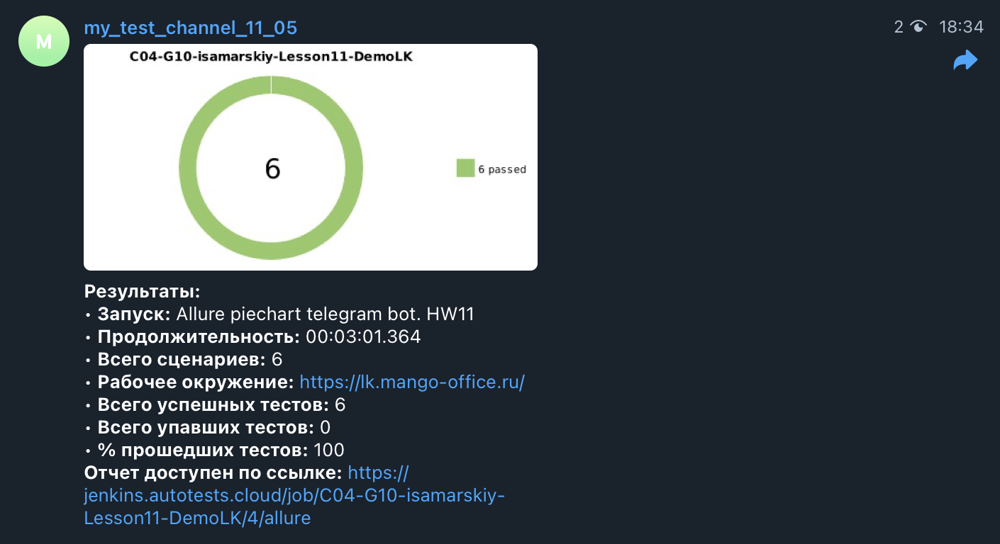
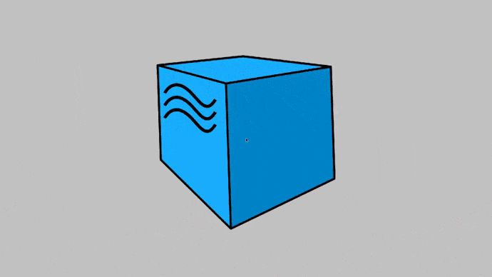

# UI autotests for demo page lk.mango-office.ru

## Technology stack
Java, Gradle, Junit5, Selenide, Allure Report, Jenkins, Selenoid, Telegram Bot.

### For run remote tests

* remote.driver (url address for selenoid)
* browser (chrome, firefox)
* video.storage 

#### Jenkins

#### Allure report

#### Telegram notification

#### Selenoid video

